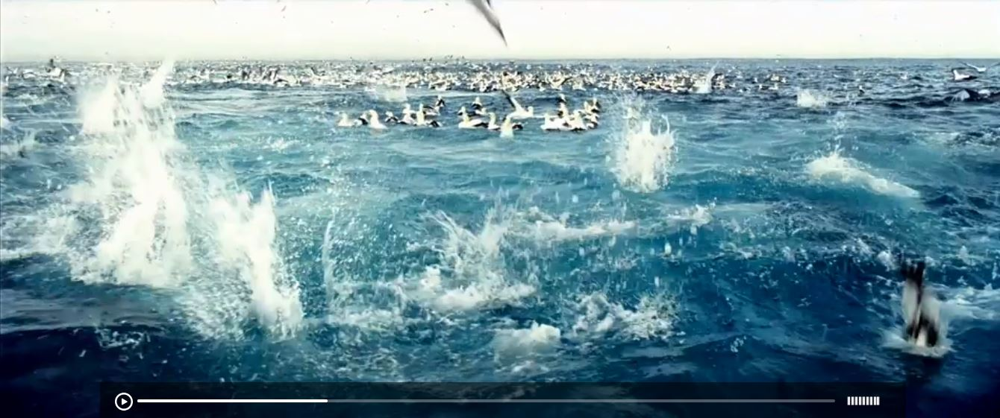

# Video js skin Fullwidth

> A [Video.js][] skin modeled on [SublimeVideo][].This is Full width and responsive.

[Video.js]: http://www.videojs.com/
[SublimeVideo]: http://www.sublimevideo.net/

 

## Getting Started

Download and copy videojs.css to your project.

```html
<link href="css/videojs.css" rel="stylesheet">
<script src="js/video.js"></script>
```


### Prerequisites

First include css/videojs.css in your HTML, and replace the vjs-default-skin in the class of your video elements with vjs-fullwidth-skin.


```html
<video
    id="my-player"
    class="video-js vjs-fullwidth-skin"
    controls
    preload="auto"
    poster=""
    data-setup='{}'>
  <source src="http://vjs.zencdn.net/v/oceans.mp4" type="video/mp4"></source>
  <source src="http://vjs.zencdn.net/v/oceans.webm" type="video/webm">
</video>
```

## Built With

* [Video.js](https://github.com/videojs/video.js) - Video.js - HTML5 Video Player

## Other Skin [videojs-sublime-skin]  

You can get SublimeVideo skin from [Cabin repository].

[Cabin repository]: https://github.com/cabin
[videojs-sublime-skin]:https://github.com/cabin/videojs-sublime-skin


